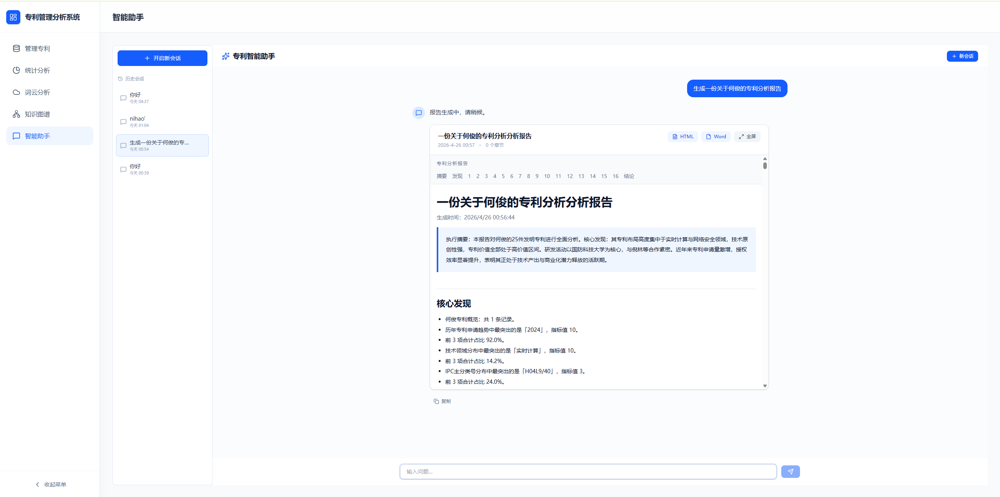
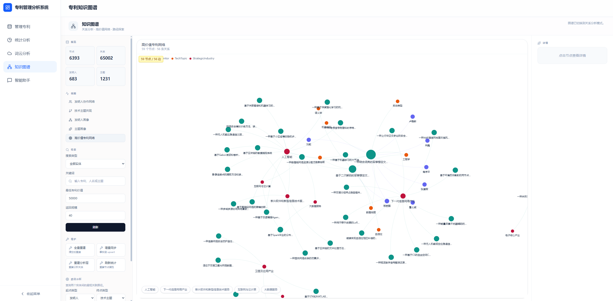
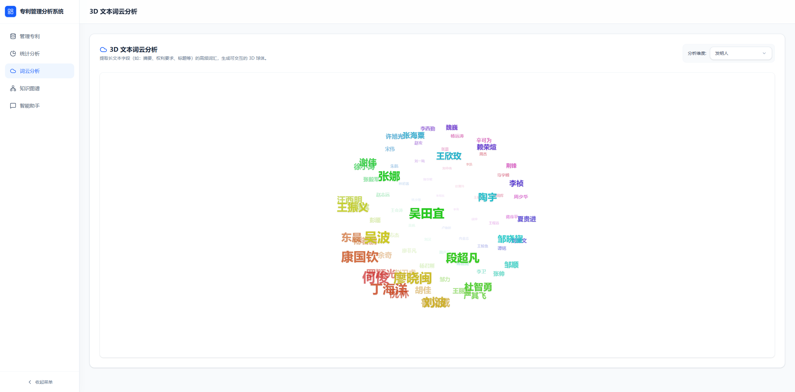
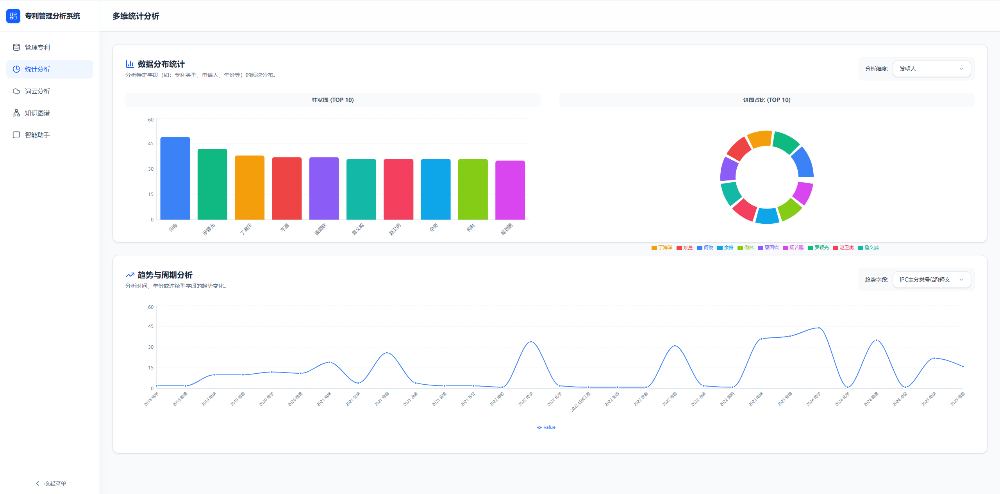

# 专利智能分析系统

基于 AI 的专利数据分析与可视化平台，集成知识图谱、多维统计分析、智能对话与报告生成能力。

## 功能概览

### 智能助手

支持自然语言交互，自动分析专利数据并生成专业分析报告。系统内置多轮对话、意图识别与流式输出。



### 专利知识图谱

基于 Neo4j 构建专利实体关系网络，支持多维度筛选，直观展示技术关联与演化路径。



### 3D 文本词云分析

动态词云可视化，展示高频关键词分布，支持按申请人或发明人维度切换。



### 多维统计分析

提供柱状图、饼图、趋势折线图等多维度统计视图，支持自定义时间范围与分析维度。



## 技术栈

| 层级 | 技术选型 |
|------|----------|
| 后端框架 | Spring Boot 3.2 + Java 21 |
| 前端框架 | React 18 + TypeScript + Vite |
| 数据库 | MySQL 8 |
| 图数据库 | Neo4j 5 |
| 搜索引擎 | Elasticsearch 8 |
| AI 引擎 | OpenAI 兼容接口 |
| 图表渲染 | ECharts + Puppeteer |
| 报告生成 | Apache POI |
| 容器化 | Docker + Docker Compose |

## 系统架构

```text
React Frontend
  -> Spring Boot Backend
    -> MySQL
    -> Neo4j
    -> Elasticsearch
    -> OpenAI Compatible API
    -> ECharts Render Service
```

## 快速开始

### 环境要求

- Docker 与 Docker Compose
- Node.js 18+
- JDK 21+

### 配置说明

当前仓库使用以下真实配置文件：

- `src/main/resources/application.yml`
- `config/ai-model.json`

启动前请按实际环境修改数据库、Neo4j、Elasticsearch 和 AI 接口配置。

`config/ai-model.json` 示例：

```json
{
  "apiKey": "sk-YOUR_API_KEY",
  "modelName": "deepseek-chat",
  "baseUrl": "https://api.deepseek.com"
}
```

### Docker 部署

```bash
docker build -t patent-system-app:1.0.0 .
docker compose up -d
```

访问地址：`http://localhost:3333`

### 本地开发

```bash
# 后端
mvn spring-boot:run

# 前端
cd patent-frontend
npm install
npm run dev

# ECharts 渲染服务
cd ../echarts-server
npm install
node server.js
```

## 项目结构

```text
patent-system/
├── src/main/java/com/example/patent/   # Spring Boot 后端
├── patent-frontend/                    # React 前端
├── echarts-server/                     # 图表渲染服务
├── docs/                               # 文档与截图
├── config/                             # 运行配置
└── docker-entrypoint.sh                # 容器启动脚本
```

## 核心能力

- AI 对话分析与流式输出
- 专利知识图谱可视化
- 多维度统计分析
- 报告生成与导出
- 运行时 AI 配置更新

## License

MIT
